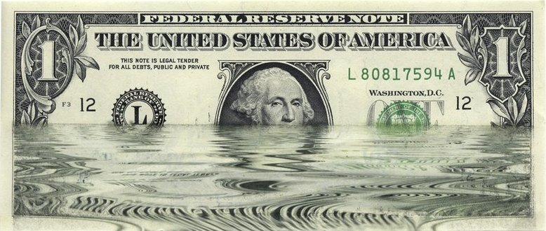

<h2>CRYPTOCURRENCY</h2>

<blockquote><h3>“We are all part of a bigger game, and Bitcoin is one of the strongest levers in that. The systems that we are influencing, that we are exerting leverage on, payments and finance, will shape what the world of tomorrow looks like.” (Edward Snowden)</h3></blockquote>

  

<!-- ################################################# -->

<h3>News</h3>

• The impact of throwing Russia out of Swift - Financial Times 
https://www.ft.com/content/7a6613c7-f2f0-4111-aaca-88867c9b8a0a 
• Confessions of a Bitcoin believer: One former miner’s journey from zealot to skeptic - Fortune 
https://fortune.com/2021/02/07/bitcoin-miner-alex-pickard 
• Record $3.8 billion stolen in crypto hacks last year, report says - CNN 
https://edition.cnn.com/2023/02/01/tech/crypto-hacks-2022/index.html 
• Report: $1.9 billion stolen in crypto hacks so far this year - CNN 
https://edition.cnn.com/2022/08/16/tech/crypto-hack-rise-2022/index.html - The Hacker News 
• North Korea's Lazarus Group Launders $900 Million in Cryptocurrency 
https://thehackernews.com/2023/10/north-koreas-lazarus-group-launders-900.html 
• Justice Department Announces Court-Authorized Action to Disrupt Illicit Revenue Generation Efforts of Democratic People’s Republic of Korea Information Technology Workers - U.S. Department of Justice 
https://www.justice.gov/opa/pr/justice-department-announces-court-authorized-action-disrupt-illicit-revenue-generation 

<!-- ################################################# -->

<h3>Flag Theory - <a href="https://flagtheory.com">https://flagtheory.com</a></h3>

 

<!-- ################################################# -->

<h3>PROLEGOMENA</h3>

https://github.com/bitcoinbook/bitcoinbook 
https://forum.getmonero.org 
https://github.com/monero-project/monero 
https://github.com/evbots/dex-protocols 

 
<a href="https://bisq.network/">Bisq</a> - Exchange, Decentralized 
<a href="https://coincards.com/">Coincards</a> - Spend crypto at top brands 
<a href="https://haveno.exchange/">Haveno</a> - Opening Monero To The World 
<a href="https://localmonero.co/">LocalMonero</a> - Buy or Sell Monero Anonymously 
<a href="https://paywithmoon.com/">Moon</a> - Pay with crypto 
<a href="https://samouraiwallet.com/">Samourai Wallet</a> - A Bitcoin wallet for the streets 
<a href="https://www.travala.com/">Travala</a> - Travel with crypto 
<a href="https://privacy.com/">Privacy.com</a> 
<a href="https://www.viabuy.com/the-prepaid-mastercard-in-gold-or-black.html">Viabuy</a> 
 

<!-- ################################################# -->

• WHONIX WIKI 
https://www.whonix.org/wiki/Money 
https://www.whonix.org/wiki/Electrum 
https://www.whonix.org/wiki/Monero 
https://www.whonix.org/wiki/Ethereum 
https://www.whonix.org/wiki/Bisq 
 

• KICKSECURE WIKI 
https://www.kicksecure.com/wiki/Cryptocurrency_Security_Threats 
https://www.kicksecure.com/wiki/Hardware_Wallet_Security 
https://www.kicksecure.com/wiki/Ledger_Hardware_Wallet 
 

• HARDWALLETS 
https://www.youtube.com/c/CryptoDad 
https://github.com/epiccurious/jade-diy 

<!-- ################################################# -->

<h3>OPSEC</h3>

<a href="https://anonymousplanet.org/" target="_blank"><b>Anonymous Planet</b> - The Hitchhiker’s Guide</a><a href="https://anonymousplanet.org/export/guide.pdf" target="_blank">&nbsp; (PDF)</a> 

https://github.com/OffcierCia/Crypto-OpSec-SelfGuard-RoadMap 
https://github.com/Mikerah/awesome-privacy-on-blockchains 
https://github.com/BlockchainCommons/Pseudonymity-Guide 
https://github.com/taxmeifyoucan/p2p-trading 
https://github.com/austintgriffith/burner-wallet 

• TAILS 
https://github.com/Techs2Help/TailsOS_cold_storage 
https://github.com/BenWestgate/Bails 
https://github.com/BenWestgate/bitcoin-core-on-tails 

<!-- ################################################# -->

<h3>LEGAL TENDER</h3>
https://github.com/acceptbitcoincash/acceptbitcoincash 

<!-- ################################################# -->

Glossary of Terms

<table>
<tr>
<td>• ATM - </td>
<td>• </td>
<td>• </td>
<td>• </td>
<td>• </td>
</tr>
<tr>
<td>• AML - </td>
<td>• DEX - </td>
<td>• </td>
<td>• </td>
<td>• </td>
</tr>
<tr>
<td>• KYC -</td>
<td>• Rekt -</td>
<td>• </td>
<td>• </td>
<td>• </td>
</tr>
</tr>
</table>

