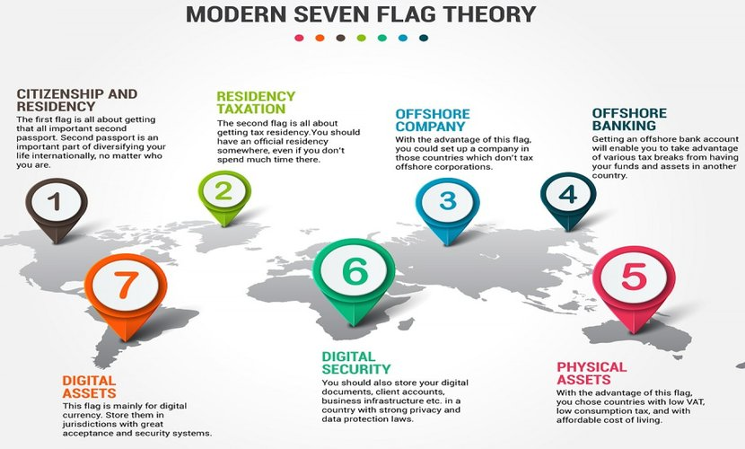

<!DOCTYPE html>
<html lang='en'>

<head>

  <meta charset='UTF-8'>

<body>

<h1>🏛️🏧🪙 CRYPTOCURRENCY 🪙🏧🏛️</h1>

<blockquote><h3>“We are all part of a bigger game, and Bitcoin is one of the strongest levers in that. The systems that we are influencing, that we are exerting leverage on, payments and finance, will shape what the world of tomorrow looks like." (Edward Snowden)</h3></blockquote>

  

<!-- ################################################# -->

<h3>News</h3>

• The New Satoshi Emails: Early Developer Sirius Releases 120 Pages Detailing Work On Bitcoin - Bitcoin Magazine (2024-02-23) 
https://bitcoinmagazine.com/culture/newly-revealed-satoshi-email-correspondence-with-martti-malmi 
• Read Adam Back's Complete Emails With Bitcoin Creator Satoshi Nakamoto - Bitcoin Magazine  (2024-02-23) 
https://bitcoinmagazine.com/technical/bitcoin-adam-backs-complete-emails-satoshi-nakamoto 
• Confessions of a Bitcoin believer: One former miner’s journey from zealot to skeptic - Fortune (2021-02-07) 
https://fortune.com/2021/02/07/bitcoin-miner-alex-pickard 
• They Cracked the Code to a Locked USB Drive Worth $235 Million in Bitcoin. Then It Got Weird - Wired (2023-09-24) 
https://www.wired.com/story/unciphered-ironkey-password-cracking-bitcoin 
• Record $3.8 billion stolen in crypto hacks last year, report says - CNN (2023-02-01) 
https://edition.cnn.com/2023/02/01/tech/crypto-hacks-2022/index.html 
• Report: $1.9 billion stolen in crypto hacks so far this year - CNN (2022-08-16) 
https://edition.cnn.com/2022/08/16/tech/crypto-hack-rise-2022/index.html  

<h4>Geopolitics</h4>
• Founders And CEO Of Cryptocurrency Mixing Service Arrested And Charged With Money Laundering And Unlicensed Money Transmitting Offenses - US (2024-05-24)
https://www.justice.gov/usao-sdny/pr/founders-and-ceo-cryptocurrency-mixing-service-arrested-and-charged-money-laundering 
• Monero Founder Refutes Allegations of Helping Interpol Trace Funds - Beincrypto (2023-03-22) 
https://beincrypto.com/monero-founder-refutes-allegations-interpol-trace-funds/ 
• The impact of throwing Russia out of Swift - Financial Times (2022-02-25) 
https://www.ft.com/content/7a6613c7-f2f0-4111-aaca-88867c9b8a0a 
• BRICS to Develop Blockchain-Based Payment System to Bypass the Dollar - Money Metals (2024-03-07) 
https://www.moneymetals.com/news/2024/03/07/brics-bloc-plans-to-develop-blockchain-based-payment-system-to-bypasses-the-dollar-003033 
• Venezuela rushes to mend Iran relationship as US sanctions loom - Reuters (2024-03-12) 
https://www.reuters.com/markets/commodities/venezuela-rushes-mend-iran-relationship-us-sanctions-loom-2024-03-12/?ref=upstract.com 
• North Korea's Lazarus Group Launders $900 Million in Cryptocurrency - The Hacker News (2023-10) 
https://thehackernews.com/2023/10/north-koreas-lazarus-group-launders-900.html 
• Justice Department Announces Court-Authorized Action to Disrupt Illicit Revenue Generation Efforts of Democratic People’s Republic of Korea Information Technology Workers - U.S. Department of Justice (2023-09-18) 
https://www.justice.gov/opa/pr/justice-department-announces-court-authorized-action-disrupt-illicit-revenue-generation 

<!-- ################################################# -->

<h3>Flag Theory - <a href="https://flagtheory.com">https://flagtheory.com</a></h3>

 

<!-- ################################################# -->

<h3>PROLEGOMENA</h3>

<h4>• WHONIX WIKI</h4>

https://www.whonix.org/wiki/Money 
https://www.whonix.org/wiki/Electrum 
https://www.whonix.org/wiki/Monero 
https://www.whonix.org/wiki/Ethereum 
https://www.whonix.org/wiki/Bisq 

<h4>• KICKSECURE WIKI</h4>

https://www.kicksecure.com/wiki/Cryptocurrency_Security_Threats 
https://www.kicksecure.com/wiki/Hardware_Wallet_Security 
https://www.kicksecure.com/wiki/Ledger_Hardware_Wallet 

<h4>• COLD STORAGE</h4>

https://github.com/Techs2Help/TailsOS_cold_storage 
https://github.com/BenWestgate/Bails 
https://github.com/BenWestgate/bitcoin-core-on-tails 
https://www.youtube.com/c/CryptoDad 
https://github.com/epiccurious/jade-diy 
https://github.com/JWWeatherman/yeticold 

<h4>• DECENTRALIZED EXCHANGE (DEX)</h4>

KYC? Not me - https://kycnot.me 
https://stealthex.io 
https://simpleswap.io 
https://github.com/evbots/dex-protocols 

<h4>Bitcoin (BTC)</h4>

https://github.com/bitcoinbook/bitcoinbook 

<h4>Monero (XMR)</h4>

https://getmonero.org 
https://forum.getmonero.org 
https://github.com/monero-project/monero 
https://xmrguide.org 
https://moneropolicy.org 
https://github.com/UkoeHB/Monero-RCT-report 
https://blog.chainalysis.com/reports/all-about-monero 

<h4>Tron (TRX)</h4>

https://tron.network/trx?lng=en 
https://github.com/tronprotocol 
https://sunswap.com 

<h4>Zcash (ZEC)</h4>

https://z.cash 
https://github.com/zcash/zcash 
https://flyp.me 

<h4>Dash</h4>

https://www.dash.org 

 
 

<ul>
<li><a href="https://bisq.network/">Bisq</a> - Exchange, Decentralized</li>
<li><a href="https://coincards.com/">Coincards</a> - Spend crypto at top brands</li>
<li><a href="https://haveno.exchange/">Haveno</a> - Opening Monero To The World</li>
<li><a href="https://localmonero.co/">LocalMonero</a> - Buy or Sell Monero Anonymously</li>
<li><a href="https://paywithmoon.com/">Moon</a> - Pay with crypto</li>
<li><a href="https://samouraiwallet.com/">Samourai Wallet</a> - A Bitcoin wallet for the streets</li>
<li><a href="https://www.travala.com/">Travala</a> - Travel with crypto</li>
<li><a href="https://privacy.com/">Privacy.com</a> - Protect Your Payments and Keep Free Trials Free</li>
<li><a href="https://www.viabuy.com/the-prepaid-mastercard-in-gold-or-black.html">Viabuy</a> - Online account with personal IBAN and Prepaid Mastercard. Without stress! </li>
</ul>

<!-- ################################################# -->

<h3>OPSEC</h3>

• <a href="https://anonymousplanet.org/" target="_blank"><b>Anonymous Planet</b> - The Hitchhiker’s Guide</a><a href="https://anonymousplanet.org/export/guide.pdf" target="_blank">&nbsp; (PDF)</a> 

• <a href="http://biblemeowimkh3utujmhm6oh2oeb3ubjw2lpgeq3lahrfr2l6ev6zgyd.onion">DNM Bible - http://biblemeowimkh3utujmhm6oh2oeb3ubjw2lpgeq3lahrfr2l6ev6zgyd.onion</a>

• <a href="http://xmrguide25ibknxgaray5rqksrclddxqku3ggdcnzg4ogdi5qkdkd2yd.onion">XMRGuide - http://xmrguide25ibknxgaray5rqksrclddxqku3ggdcnzg4ogdi5qkdkd2yd.onion</a>

• Blockchain dark forest selfguard handbook 
https://github.com/slowmist/Blockchain-dark-forest-selfguard-handbook 

• Crypto-OpSec-SelfGuard-RoadMap 
https://github.com/OffcierCia/Crypto-OpSec-SelfGuard-RoadMap 

• Awesome privacy on blockchains 
https://github.com/Mikerah/awesome-privacy-on-blockchains 

• Pseudonymity Guide 
https://github.com/BlockchainCommons/Pseudonymity-Guide 

<h4>P2P Trading</h4>

• P2P Trading 
https://github.com/taxmeifyoucan/p2p-trading 

<h4>Burner Wallet</h4>

• Burner Wallet 
https://github.com/austintgriffith/burner-wallet 

<!-- ################################################# -->

<h3>LEGAL TENDER</h3>
https://github.com/monerica-project/monerica 
https://github.com/acceptbitcoincash/acceptbitcoincash 
https://github.com/galtproject/galtproject-core 

<!-- ################################################# -->

<h3>SMART CONTRACTS - REGULATORY ARBITRAGE</h3>
https://www.forbes.com/sites/forbesbusinesscouncil/2022/03/17/smart-contracts-and-the-law-what-you-need-to-know/ 

 

<!-- ################################################# -->

<h3>CRYPTOCURRENCIES ANALYSIS</h3>

Blockchain Explorers

https://github.com/OffcierCia/On-Chain-Investigations-Tools-List 
https://github.com/aaarghhh/awesome_osint_criypto_web3_stuff 
https://blocksherlock.com/home/blockchain-explorers 
https://mempool.space 
https://blockchain.info 
https://tronscan.org 
https://etherscan.io 
https://algoexplorer.io 
https://explorer.solana.com 
https://stellar.expert 
https://snowtrace.io 
https://flowscan.org 
https://polygonscan.com 

Paid services

https://chainalysis.com 
https://elliptic.co 
https://ciphertrace.com 
https://coinmetrics.io 
https://ciphertrace.com 
https://elementus.io 
https://trmlabs.com 
https://bitok.org/investigations 

Tools

https://github.com/OffcierCia/On-Chain-Investigations-Tools-List 
https://github.com/nongiach/awesome-cryptocurrency-security 
https://github.com/demining/CryptoDeepTools 
https://github.com/demining/bitcoindigger 
https://github.com/s0md3v/Orbit 
https://github.com/demining/Dao-Exploit 
https://github.com/immunefi-team/Web3-Security-Library/blob/main/Tools/README.md#blockchain-analysis 
https://github.com/Seb2lyon/BTCscan 

<!-- ################################################# -->

<h3>HOME MINING</h3>

Tools

https://github.com/satoshi-anonymoto/pleb-miners 
https://github.com/Der-Schweisser/Immersion_Plep_Miner 

<!-- ################################################# -->

Others

 

https://www.moneylaundering.com 
https://financialcrimeacademy.org 
https://kycnot.me 
https://www.unodc.org/e4j/en/cybercrime/module-13/additional-teaching-tools.html 

 

<!-- ################################################# -->

Glossary of Terms

<table>
<tr>
<td>• ATM - </td>
<td>• </td>
<td>• </td>
<td>• </td>
<td>• </td>
</tr>
<tr>
<td>• AML - </td>
<td>• DEX - </td>
<td>• </td>
<td>• </td>
<td>• </td>
</tr>
<tr>
<td>• KYC -</td>
<td>• Rekt -</td>
<td>• </td>
<td>• </td>
<td>• </td>
</tr>
</tr>
</table>

 

<!--################################### -->

 <a href="https://github.com/RENANZG/My-Onion-Links?tab=readme-ov-file#">Back to Top ⬆</a> 

<!--################################### -->

 
 
 

Made with ♥

<!--################################### -->

</body>
</html>
